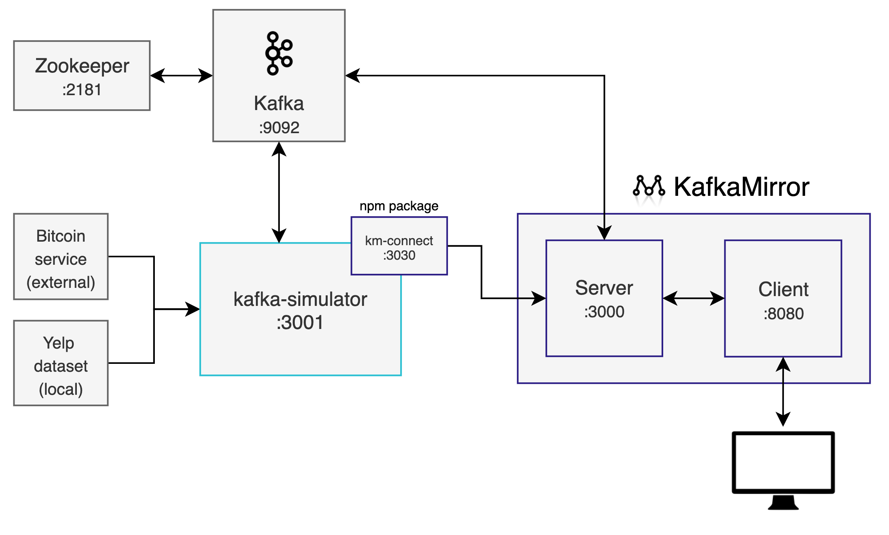

# kafka-simulator

An easy-to-use Kafka simulator app for learning Kafka.

kafka-simulator is a great way to start learning about Kafka in

So you'd like to learn about Kafka but you aren't sure where to start? kafka-simulator is meant to provide an easy-to-use Kafka simulation environment to get you creating messages to partitions in no-time!

## Motivation

There are many moving parts with a Kafka cluster, which creates high barriers of entry. We wanted to develop a solution to fix this problem. With kafka-simulator, you can get a Kafka simulation environment up and running very quickly with little to no configuration required.

## Getting Started

**NOTE**: This project depends on Docker. For information on installing Docker, please visit [this page](https://docs.docker.com/get-docker/).

Getting started is as easy as 1, 2, 3...

1. Download and `cd` into the repository

2. Run `npm run simulate`

3. In another terminal, run `npm run bitcoin`

## Overview

There are a few pieces to kafka-simulator to be aware of.

First, we're using the `spotify/kafka` Docker image for Kafka and Zookeeper, referenced in the diagram below. The nice thing about this image is that it includes Kafka and Zookeeper together pre-configured. When you first run the `npm run simulate` command, this will download the image from dockerhub.com.

Now that we have Kafka and Zookeeper ready to go, we'll need a way to have a producer create a message to send to Kafka. This is where kafka-simulator comes in. Out-of-box, kafka-simulator is configured for 2 streams, a Bitcoin transactions stream, and a Yelp dataset stream that is generated by parsing a local dataset.

kafka-simulator uses streams and a producer to create messages that are sent to Kafka.

**NOTE**: kafka-simulator and KafkaMirror connect to Kafka through KafkaJS.

## Guides

There are two ways to simulate Kafka traffice with kafka-simulator. The following guides will walk you through starting the Bitcoin transactions, or the Yelp dataset guide.

### Bitcoin Transactions Guide

This method uses an open-source Bitcoin transactions WebSocket. Every time there is a Bitcoin transaction, a Kafka producer will create a message in a `transactions` topic. A consumer will then consume that data and produce another message in the `calculatedTransactions` topic.

To start this simulator, run `npm run bitcoin` (Kafka and Zookeeper must be running).

### Yelp Dataset Guide

This part requires a little extra work but is _very_ rewarding! With this method, you can parse a 5.2 million review Yelp dataset for reviews that include a word of your choosing. By default, the parser searches for reviews that include the word _pancake_, but you can easily change this.

#### Installing & Configuring the Yelp Dataset

1. To download the Yelp dataset, go to https://www.kaggle.com/yelp-dataset/yelp-dataset and download the datasets (a free kaggle account is required).
1. Once you've downloaded the dataset, place the `yelp_academic_dataset_review.json` file in a folder named `yelp` in the same directory as kafka-simulator.

**Example**:

Desktop folder

- "kafka-simulator" folder
- "yelp" folder

To start this simulator, run `npm run yelp` (Kafka and Zookeeper must be running).

## Verifying Kafka Traffic

To see the Kafka traffic, we recommend using [KafkaMirror](https://github.com/oslabs-beta/KafkaMirror) or a desktop tool like [Kafka Tool](https://www.kafkatool.com/).

## Docker

@todo

## Contributors

[Joe Kinney](https://github.com/joekinney-png),
[Jonah Stewart](https://github.com/jonahlstewart),
[Keon Kim](https://github.com/Keon-Kim-0),
[Mark Miller](https://github.com/markmanuelmiller),
[Tobi-Wan Rhodes](https://github.com/rtobiwan)
